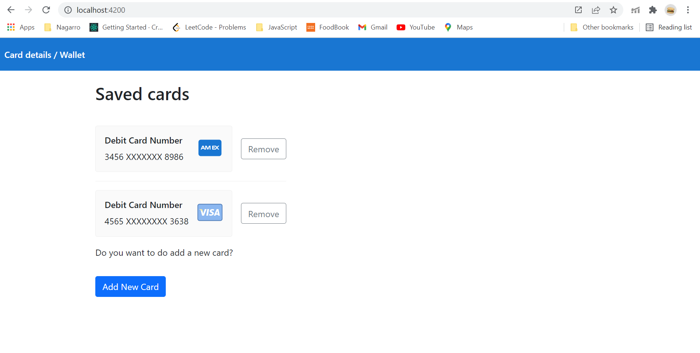

# Manage Cards

## Development server        
* Clone code to your local system `git clone https://github.com/love9684/manage-card.git`.
* Go to main folder using `cd manage-card` and Install Angular dependency `npm install`.
* Now install Node dependency, First go to server folder `cd server` then run `npm install`.
* Now come to main folder using `cd ..` and then start server using `npm run dev`.
* Navigate to `http://localhost:4200/`.

